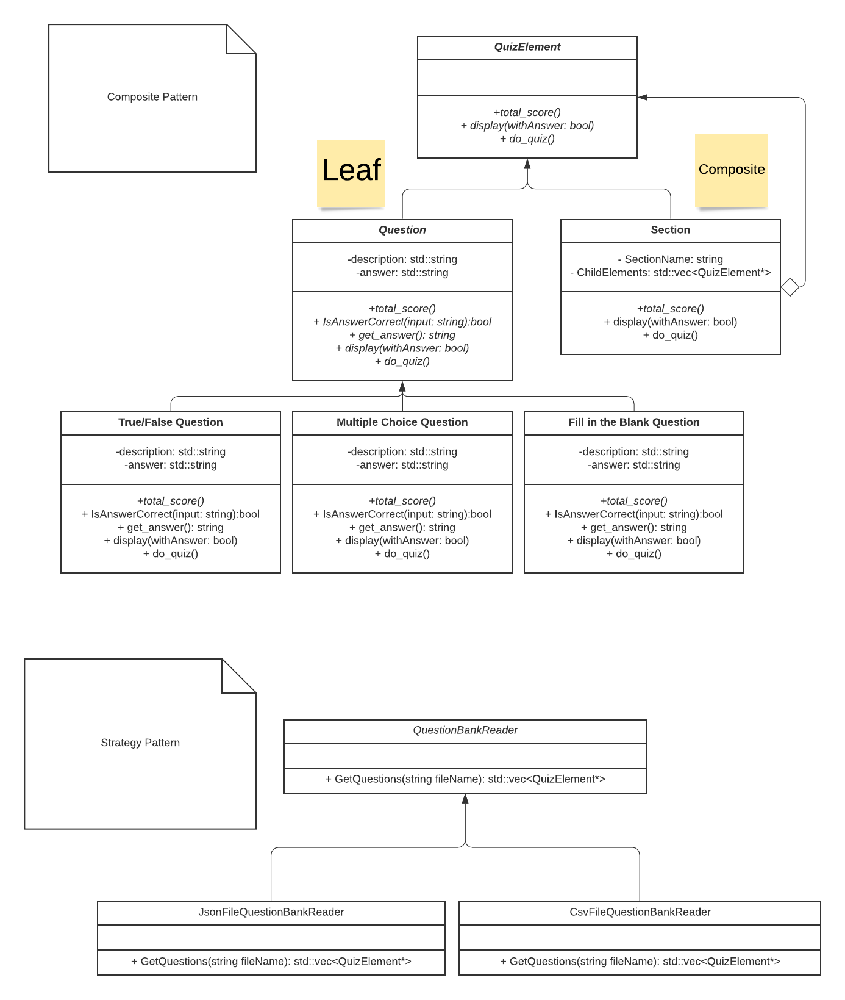

# Quiz Maker
Authors: [Susan Noori](https://github.com/susan2099), [Lunette Si](https://github.com/lunettesi), [Henry Moore](https://github.com/hmoorerg)

## Project Description
### Why is it important or interesting to you?
It is important, when it comes to creating and grading, that quizzes are efficient. Sometimes, when taking online quizzes, connectivity issues arise and the student loses all of their progress. By allowing teachers to directly upload the test file, the student can answer it no matter where they are without needing high-speed internet, alleviating this issue. Additionally, this quiz maker can also be used for fun events like trivia games, where the questions are more focused on interesting facts. 
### What languages/tools/technologies do you plan to use?
We will be using C++ for our project. 
### What will be the input/output of your project?
First, a teacher user will input a file including all of the questions and the accepted answers. The questions can be multiple choice, true/false, and free response; for all questions except free response, the correct answer would also be included. Then, a student user can take the uploaded quiz. Each question will be displayed, and once the user types in their answer, the next question would show up, until the quiz is finished. Once the quiz is completed, the program will then display all the questions again, this time with both the user's answers and the correct answer.
### What are the two design patterns you will be using? For each design pattern you must explain in 4-5 sentences:
One of the design patterns we will be using is the Composite pattern. Our problem is that the application will have to split questions into different sections. By using the composite pattern, we can draw questions outside of sections in the same way that we draw questions inside of sections by calling the draw method that will exist in the section class and question class. It will also allow us to easily create new kinds of questions by simply adding a new class to the project. This design pattern is a good solution because it will play a major role in reducing coupling in our design, allowing for changes in the future if necessary.

The other design pattern we will use is the Abstract Factory. We chose this pattern so we can make question pools using a variety of file types (such as JSON or CSV) by just changing the factory and not the rest of the core logic. Because there are multiple file types that can contain our quiz questions, it is essential that we do not directly rely on individual file types. An abstract factory solves this issue by making it simple to add new file types by reducing coupling to our question bank class implementation, we simply ask the factory for a type of question bank and it retrieves the correct class and returns it. Although the project will currently only use the factory to handle different question bank filetypes, in the future this pattern would give us the opportunity to create question factories for non-file situations such as by using an online question bank (using something such as tcp) or a random question generator without major changes to the code outside of the abstract factory.

## Class Diagram
 We will be using the Composite pattern (at the top of the diagram) as well as the Strategy pattern (below the composite pattern on the diagram) in this project. 

The composite pattern will allow us to separate the quiz into different sections or even subsections. A section can be placed anywhere a question can be placed, allowing complete flexibility in how quizzes are organized.

The strategy pattern allows for more flexibility in terms of file formats. We plan to accept multiple file formats and with the strategy pattern we can inject a class that handles the file format that the user wishes to use. This will allow us to support CSV and JSON files with the opportunity to easily extend to more formats in the future.

 

 > ## Final deliverable
 > All group members will give a demo to the TA during lab time. The TA will check the demo and the project GitHub repository and ask a few questions to all the team members. 
 > Before the demo, you should do the following:
 > * Complete the sections below (i.e. Screenshots, Installation/Usage, Testing)
 > * Plan one more sprint (that you will not necessarily complete before the end of the quarter). Your In-progress and In-testing columns should be empty (you are not doing more work currently) but your TODO column should have a full sprint plan in it as you have done before. This should include any known bugs (there should be some) or new features you would like to add. These should appear as issues/cards on your Kanban board. 
 
 ## Screenshots

 ## Installation/Usage
 > Instructions on installing and running your application
 ## Testing
 > How was your project tested/validated? If you used CI, you should have a "build passing" badge in this README.
 
